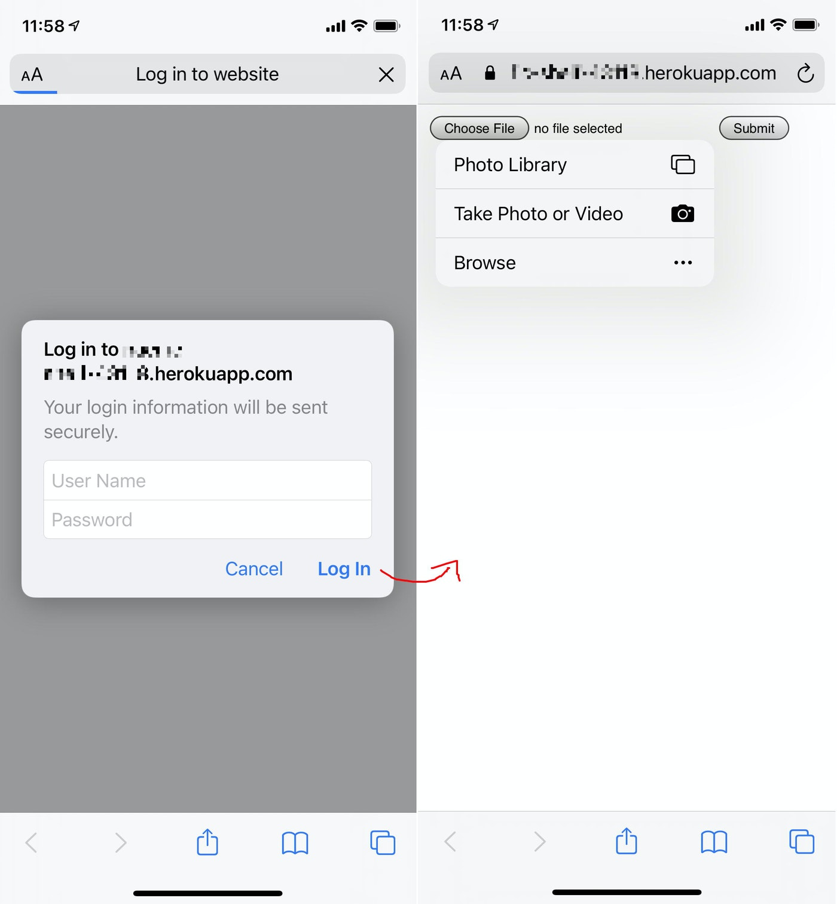

# s3-uploader
## description
deploy AWS S3 uploader web site on heroku

set env to execute the flask app on heroku

```
(venv)$heroku config:set FLASK_APP=upload.py
(venv)$heroku config:set FLASK_CONFIG=heroku
```

set env to access AWS S3 with the bucket name and access key being created at AWS IAM security credentials

```
(venv)$heroku config:set S3BUCKET=s3_bucket_name
(venv)$heroku config:set AWS_ACCESS_KEY_ID=xxxxxxxxxxxxxxxxxxxx
(venv)$heroku config:set AWS_SECRET_ACCESS_KEY=xxxxxxxxxxxxxxxxxxxxxxxxxxxxxx
```

set password to env for basic authentication
id `user` is embedded to the source code.

```
(venv)$heroku config:set USER_PW=xxxxxxxx
```

## usage
1. access to `https://xxxxxxx-xxxxxx-xxxxxx.herokuapp.com/upload` which is deployed
2. basic authentication appears.
3. simple UI to upload a file appears.



## s3 mount
You can mount the s3 bucket to your local file system like this:

```
sudo s3fs s3_bucket_name /home/pi/s3fs_from/ -o allow_other -o uid=1000 -o gid=1000
```
